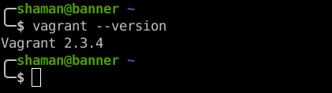
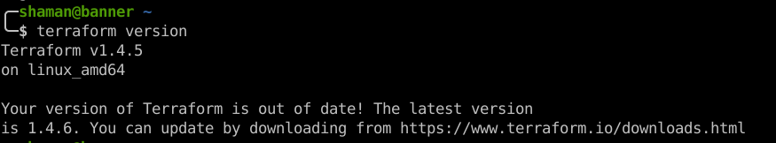
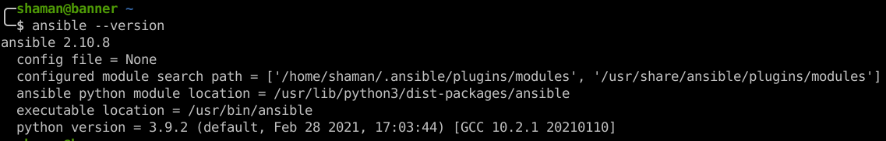
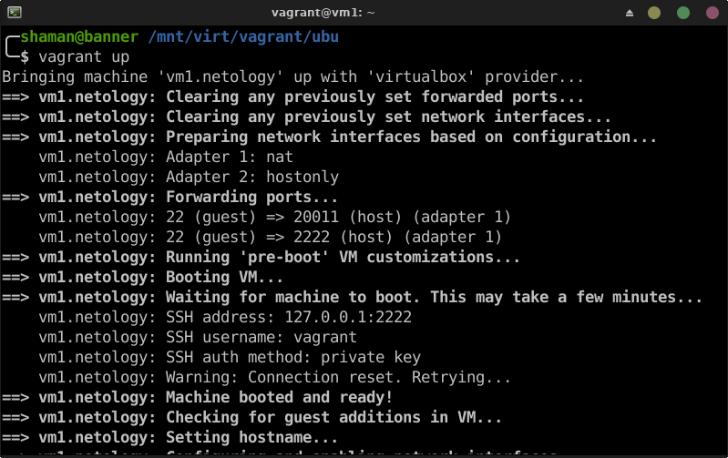
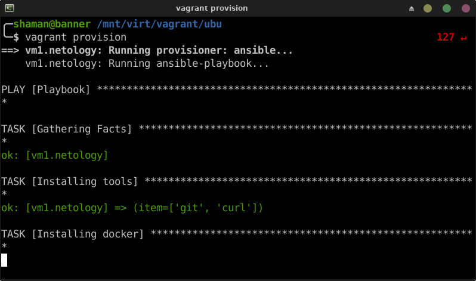
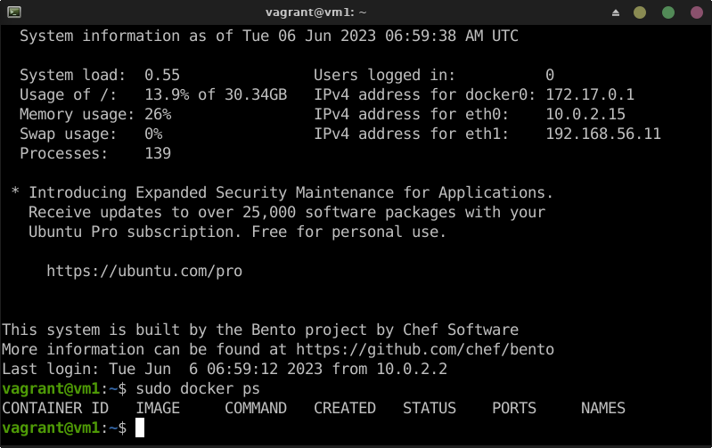

# Домашнее задание к занятию "`Применение принципов IaaC в работе с виртуальными машинами`" - `Живарев Игорь`


### Задание 1

- Опишите основные преимущества применения на практике IaaC-паттернов.
- Какой из принципов IaaC является основополагающим?


1. Основные преимущества IaC:

- Развертывание: отказ от ручного взаимодействия с облачными провайдерами повышает скорость развертывания.
- Восстановление: выявление проблем в конфигурации обеспечивает быстрое восстановление после сбоев.
- Последовательность: каждый раз ресурсы развертываются одинаково, что уменьшает уязвимость инфраструктуры.
- Модификация: изменение ресурсов требует меньшего оборотного времени.
- Возможность повторного использования: есть возможность повторно использовать части текущей инфраструктуры в своих будущих проектах.
- Контроль версий: код инфраструктуры хранится в системах контроля версий.
- Визуальный доступ: создавая конфигурацию в виде кода, по сути получаете документацию для вашей инфраструктуры.

В рамках рабочего процесса IaC есть возможность многократно разворачивать инфраструктуру стандартизованным образом, благодаря чему разработка и тестирование программного обеспечения займут меньше времени (поскольку среда разработки, промежуточная среда, и среда тестирования разделены). ВОчень быстро можно повторить процесс написания кода и его тестирования вживую, развернув инфраструктуру столько раз, сколько это необходимо. Как только написанная инфраструктура будет соответствовать всем требованиям, можно развернуть ее на имеющихся мощностях, либо в облачных средах. А при возникновении новых требований - просто повторить процесс.


2. Идемпотентность, способность данной операции всегда производить один и тот же результат, является важным принципом IaC. Команда развертывания всегда устанавливает целевую среду в одну и ту же конфигурацию независимо от начального состояния среды. Идемпотентность достигается путем автоматической настройки существующего целевого объекта или путем отмены существующего целевого объекта и повторного создания новой среды.


### Задание 2

- Чем Ansible выгодно отличается от других систем управление конфигурациями?
- Какой, на ваш взгляд, метод работы систем конфигурации более надёжный — push или pull?

1. Ansible - это система управления конфигурациями, с помощью которой можно эффективно управлять большим количеством серверов.
Выгодные отличия Ansible от других систем управления конфигурациями:
- быстро осваивается, достаточно поверхностного понимания синтаксиса YAML и Jinja
- нет необходимости устанавливать специальное ПО на хосты, нужен только SSH и python
- подробная и наглядная документация
- большое количество модулей
- позволяет реализовать принцип идемпотентности в управлении состояниями хостов


2. Для управления малым парком машин лучше подходит push.

Для управления большим (больше 500 машин) лучше подоёдет pull. Реализация не потребует больших мощностей для машины управления, но при pull реализации необходимы системы с агентами. Что вызовет дополнительный расход ресурсов специалистов для подготовки машин.


### Задание 3

Приложите вывод команд установленных версий каждой из программ, оформленный в Markdown.

1. `VirtualBox`

```
╭─shaman@banner ~ 
╰─$ VBoxManage --version                                                                                                         2 ↵
7.0.6r155176

```


2. `Vagrant`

```
╭─shaman@banner ~ 
╰─$ vagrant --version   
Vagrant 2.3.4

```


3. `Terraform`

```
╭─shaman@banner ~ 
╰─$ terraform version
Terraform v1.4.5
on linux_amd64

Your version of Terraform is out of date! The latest version
is 1.4.6. You can update by downloading from https://www.terraform.io/downloads.html

```


4. `Ansible`

```
╭─shaman@banner ~ 
╰─$ ansible --version
ansible 2.10.8
  config file = None
  configured module search path = ['/home/shaman/.ansible/plugins/modules', '/usr/share/ansible/plugins/modules']
  ansible python module location = /usr/lib/python3/dist-packages/ansible
  executable location = /usr/bin/ansible
  python version = 3.9.2 (default, Feb 28 2021, 17:03:44) [GCC 10.2.1 20210110]

```



### Задание 4

Воспроизведите практическую часть лекции самостоятельно.


Создание виртуальной машины, выполнение команды `vagrant up`


Выполнение ansible-playbook, выполнение команды `vagrant provision`
`

Проверка установки docker на виртуальной машине, выполнение команды `docker ps`
`

---
